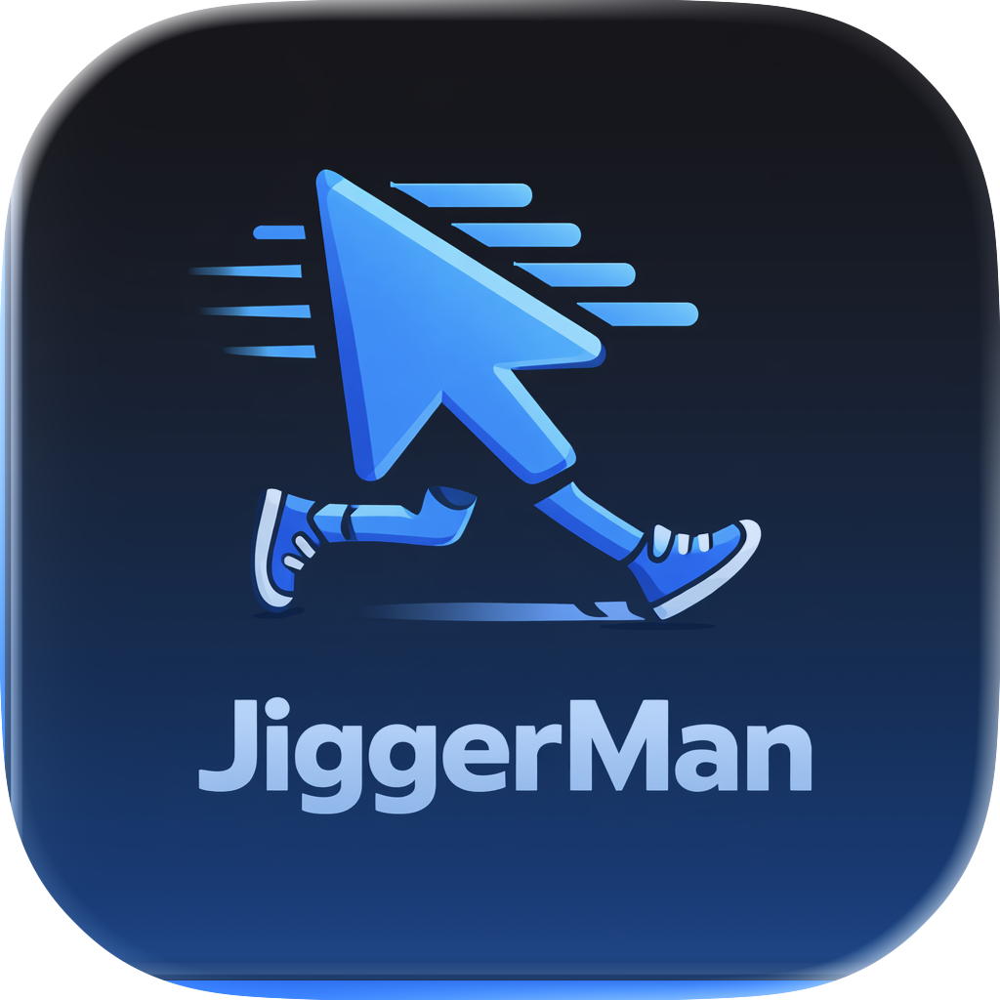

# JiggerMan

**JiggerMan** is a simple macOS utility designed to keep your computer awake and active. It prevents your status from going "Away" or "Idle" in applications like Microsoft Teams, Slack, or Discord by simulating subtle mouse movements.

## Features

- **Stay Active**: Automatically moves your mouse cursor slightly to simulate activity.
- **Customizable**: Adjust how far the mouse moves to suit your needs.
- **Discreet**: Runs quietly in your menu bar. You can choose to hide it from the Dock.
- **Privacy Focused**: No data is sent to the cloud. Everything runs locally on your Mac.

## Installation

1.  Download the latest `JiggerMan.dmg` from the [Latest Release](https://github.com/cguldogan/JiggerMan/releases/latest) page.
2.  Open the `.dmg` file and drag **JiggerMan** to your **Applications** folder.
3.  **Important**: Since this app is not signed by Apple, you may see a security warning.
    -   **Right-click** (or Control-click) the app in your Applications folder.
    -   Select **Open**.
    -   Click **Open** in the dialog box to confirm.
    -   **If that doesn't work**: Go to **System Settings > Privacy & Security**, scroll down to the **Security** section, and click **Open Anyway** next to the message "JiggerMan was blocked...".

## How to Use

1.  **Launch the app**: You'll see a small mouse icon in your menu bar (top right of your screen).
2.  **Grant Permissions**: The app requires Accessibility permissions to move the mouse. Go to **System Settings > Privacy & Security > Accessibility** and enable JiggerMan.
3.  **Start Jiggling**: Click the menu bar icon, open **Settings**, and toggle **Simulate Activity**.
4.  **Customize**: You can change the "Jiggle Distance" or toggle "Show in Dock" in the settings.

---

## Technical Details (For Developers)

### How It Works

- **Activity Simulation**: `JiggleManager` periodically moves the mouse cursor slightly to reset idle timers.
- **Orchestration**: `AppState` manages the toggle state and persistence.
- **UI**: A simple Menu Bar icon allows quick toggling. A Settings window provides logs, preferences (including Jiggle Distance and Dock visibility), and About info.

### Key Components

- `JiggerManApp.swift`: Menu bar entry point.
- `JiggleManager.swift`: Handles mouse cursor movement simulation.
- `AppState.swift`: Manages application state, logging, and dynamic Dock icon visibility (`NSApp.setActivationPolicy`).
- `ContentView.swift`: Settings UI (General, Logs, About).
- `Models.swift`: Codable models for preferences and logs.
- `PersistenceStore.swift` / `LogStore.swift`: Local state and log storage.

### Build Notes

- Requires macOS 13+.
- Run from Xcode; menu bar icon appears on launch.

